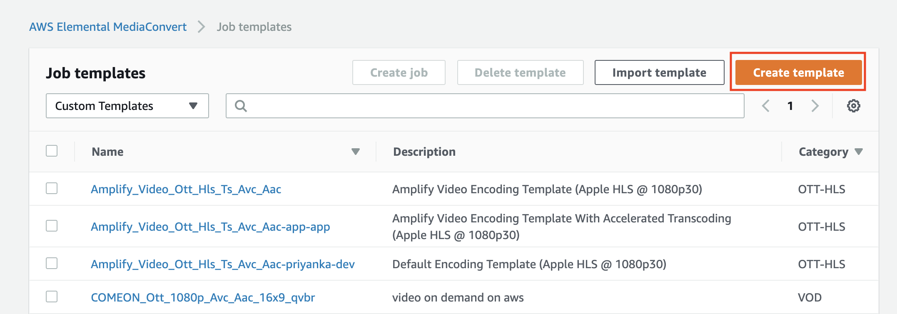
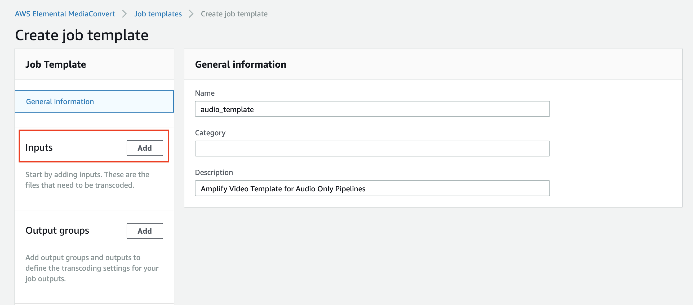
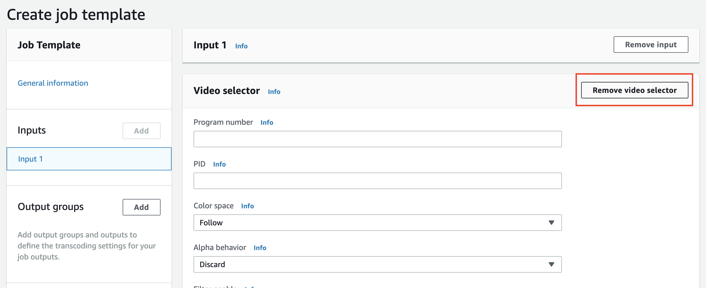
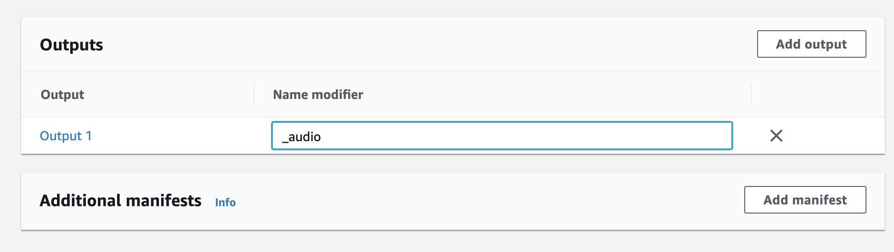
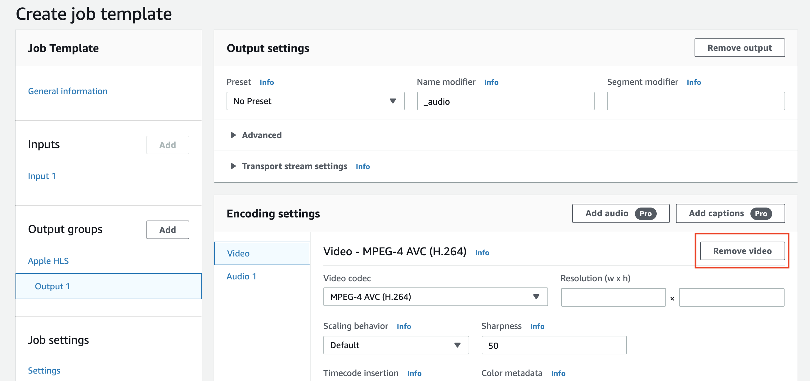

### VOD Audio Pipelines

To extend Amplify Video to support audio only inputs two changes need to be made to the resource.
1. The MediaConvert Job Template used by Amplify Video for transcoding media files needs to be changed to support audio files. In this walkthrough you will be creating a new Audio job template.
1. The S3 input bucket events need to be updated to generate events from common audio files (.mov, .mp3, etc.)

Let's start with initializing an project folder. Run the following commands and run through the amplify prompts to set up a basic amplify video project.
1. `mkdir audiotest`
1. `cd audiotest`
1. `amplify init`
1. `amplify video add` -- remember to select the Video on Demand option.

Next, open a browser window and head to the MediaConvert page and select **Job Templates**


Next, supply a Name and Description. You should then select the  **Add** button in the Input section on the left hand side.


You'll see on the left there is a single Input named "Input 1". Make sure it is selected. Your first step will be to remove the Video Selector since this pipeline will not be processing video assets.



Next you should click the **Add** button for "Output Groups" and select the **Apple HLS** radio button.

Now that you have an Output scroll down to the very bottom and provide a name modifier such as "_audio".


Then select "Output 1" on the left hand menu. Similarly to the previous steps, you need to remove the video output.


For an optional optimization, you can select **Settings** under "Job settings". Here you can manage which Queue your pipeline will use to process media as well as manage acceleration settings. 

Once the video out has been removed and settings configured as you need them, you need to view the json for the Job so that you can copy it to our project. Copy the entire JSON document to your clipboard and click out of the job settings popover.

Our last step in the console is to click the orange **Create** button to save the job template for further use.

Now you need to open our project in an IDE to edit some code and paste the JSON document.

From your project's root folder, navigate to `./amplify/video/project_name/mediaconvert-job-temp.json` and replace the json in this file with the template you copied earlier and save the file. Now when you push this resource, Amplify Video will configure the back end to use this json for the MediaConvert encoding job.

Your last step is to modify the input s3 Bucket events to support audio only file types.

Navigate to
 ```
./amplify/backend/video/project_name/vod-helpers/LambdaFunctions/SetupTriggerLambda/index.js
``` 

On line 123 you will see the Lambda Function code that creates the S3 input bucket notifications. Amplify Video is going to deploy to your AWS account when you run the final push command..  

```javascript
function createInputNotifications(config)
```

You will see that the events are created with a filter on the postfix of object put into this bucket. All you need to do is change this postfix to the file type you wish to support.

```javascript
        {
          Events: ['s3:ObjectCreated:*'],
          LambdaFunctionArn: config.IngestArn,
          Filter: {
            Key: {
              FilterRules: [{
                Name: 'suffix',
                Value: '.mp3',
              }],
            },
          },
        }
```

Go ahead and save the file and return your terminal to the root of the project directory (where you ran `amplify init`).

Run `amplify push` to push your customized resource to AWS! 

As always, you can test your deployment by uploading an audio file with the file type which you specified in the event to the Input S3 bucket.
