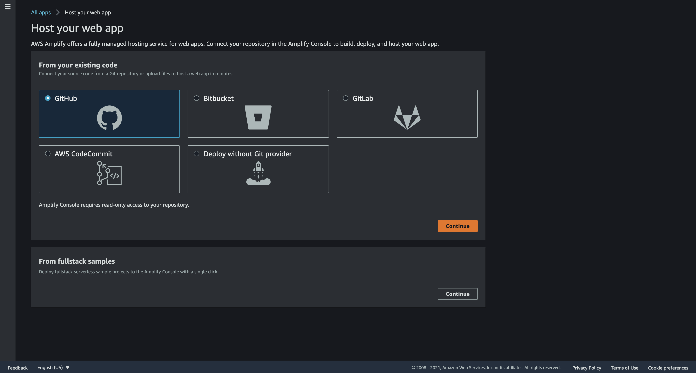
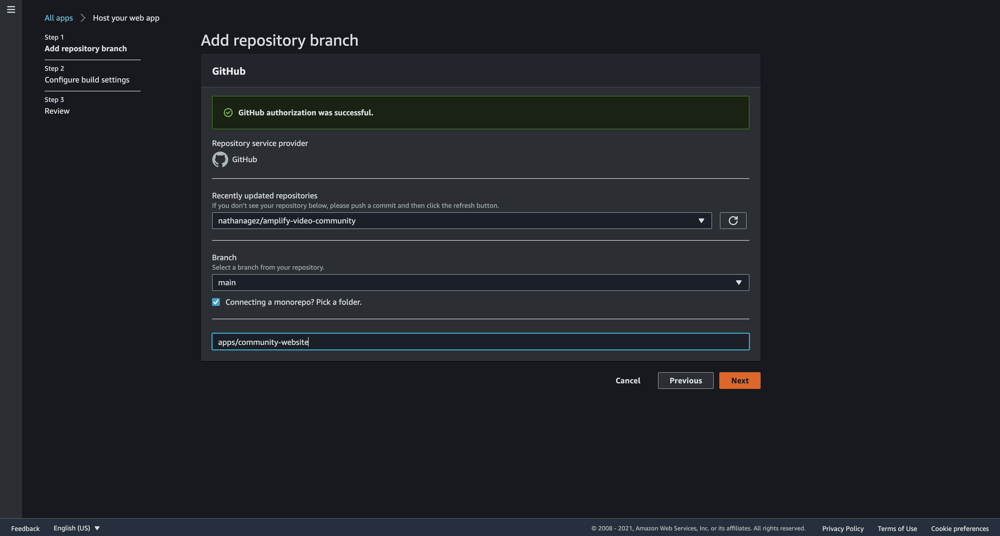
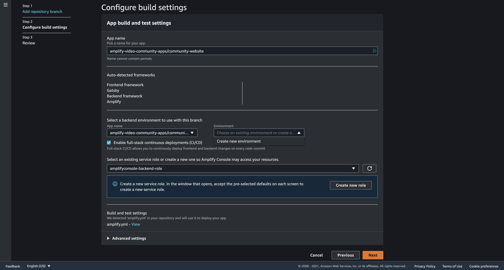
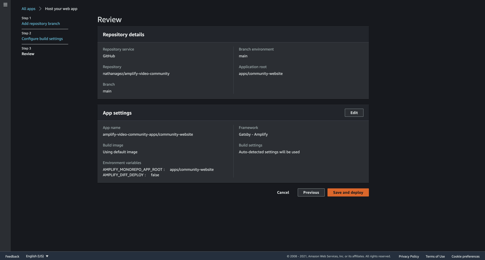
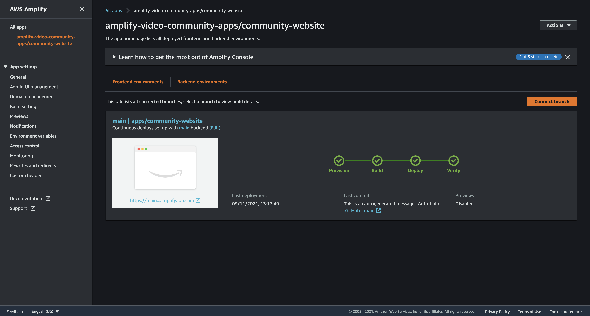
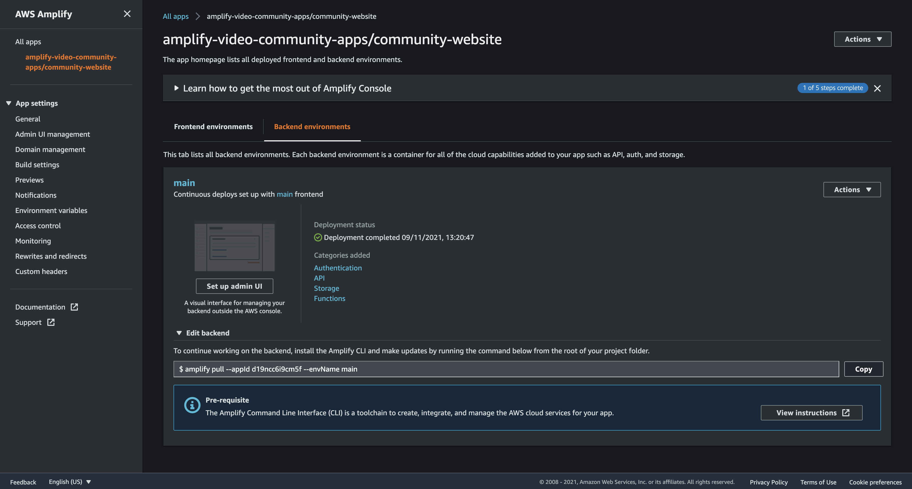

# Deployment

## Requirements
* [AWS Account](https://aws.amazon.com/account/)
* [GitHub Account](https://github.com)

## Instructions
Follow these instructions to deploy the community site:

### Deploy using Amplify Console

1. Fork the community [website repository](https://github.com/aws-samples/amplify-video-community)

2. Go to Amplify console then click `New app -> Host web app`
3. Select Github and click `Continue`

4. Select your repository and the target branch
    
    4.1. check "`Connecting a monorepo ? Pick a folder.`" and copy/paste:
    ```bash
    apps/documentation
    ```
    4.2. click `Next`
    
    

5. Configure build settings

6. Review build settings

7. Provision, build and deploy your app



### Assign a domain
To continue working on the backend, install the Amplify CLI and make updates by running the command below from the root of your project folder.



```bash
cd amplify-video-community/apps/community-website
```

```bash
amplify pull --appId <your-app-id> --envName <your-env>
```