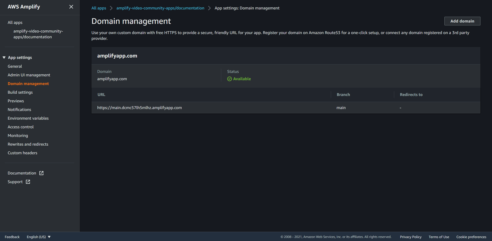

# Deployment

## Requirements
* [AWS Account](https://aws.amazon.com/account/)
* [GitHub Account](https://github.com)

## Instructions
Follow these instructions to deploy the community site:

### Deploy using Amplify Console

1. Fork the community [website repository](https://github.com/aws-samples/amplify-video-community)

2. Go to Amplify console then click `New app -> Host web app`
3. Select Github and click `Continue`

4. Select your repository and the target branch
    
    4.1. check "`Connecting a monorepo ? Pick a folder.`" and copy/paste:
    ```bash
    apps/documentation
    ```
    4.2. click `Next`
    
    

5. Configure build settings

6. Review build settings

7. Provision, build and deploy your app


### Assign a domain
Once the website is deployed, you can modify the link with one of your domains. Here for the example it will be ***trackit.io***

1.  Click on Domain Management

2.  Click on Add domain and enter the name of your root domain

3.  Click on Configure domain 
    :::info Sub-domain usage
    If you want to use a sub-domain, read the next steps carefully 
    ::: 
    3.1. Click on `Disable` to exclude the main root of your domain 
    3.2. Choose the extension name that you want and click on `Save` 

4.  SSL creation, SSL configuration and Domain activation


5.  Return to your App main page and you will see that the link has been changed
