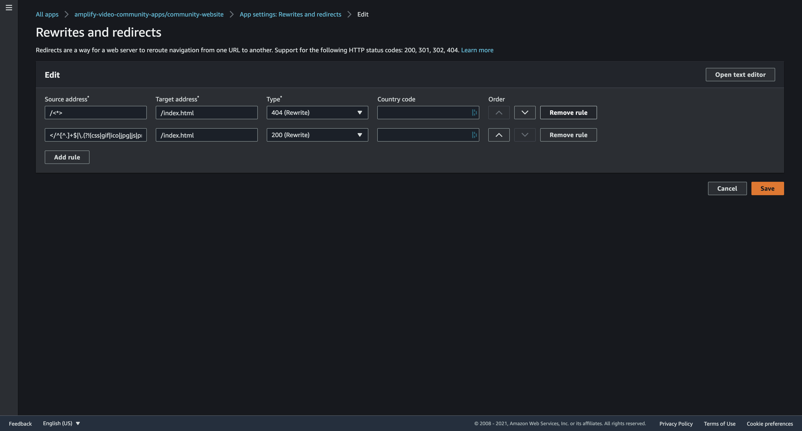
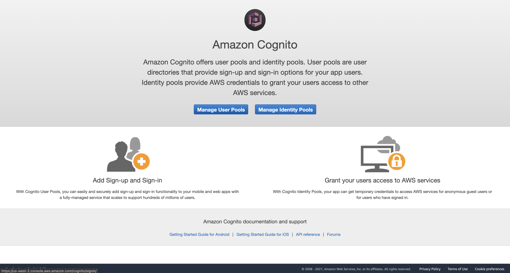
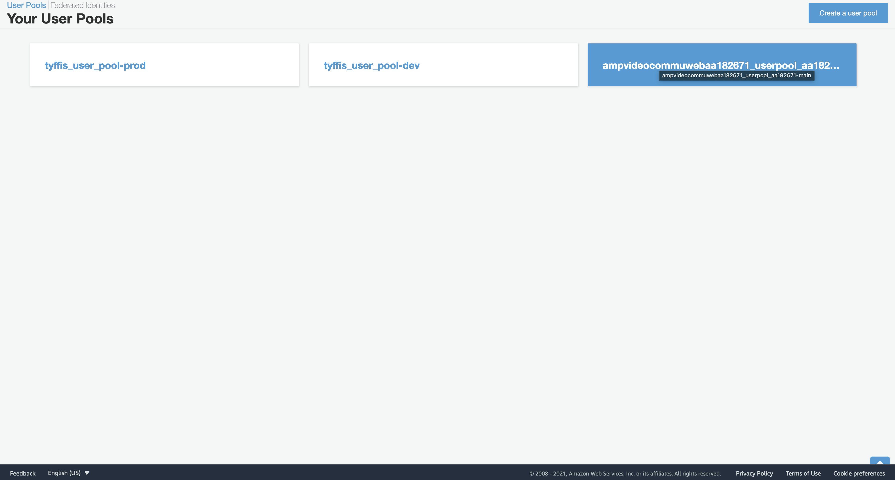
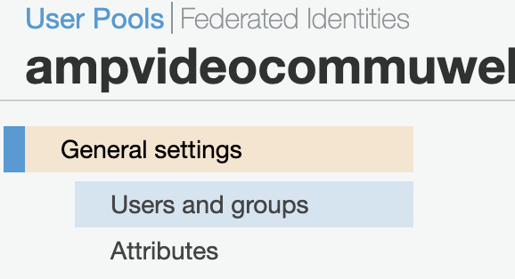
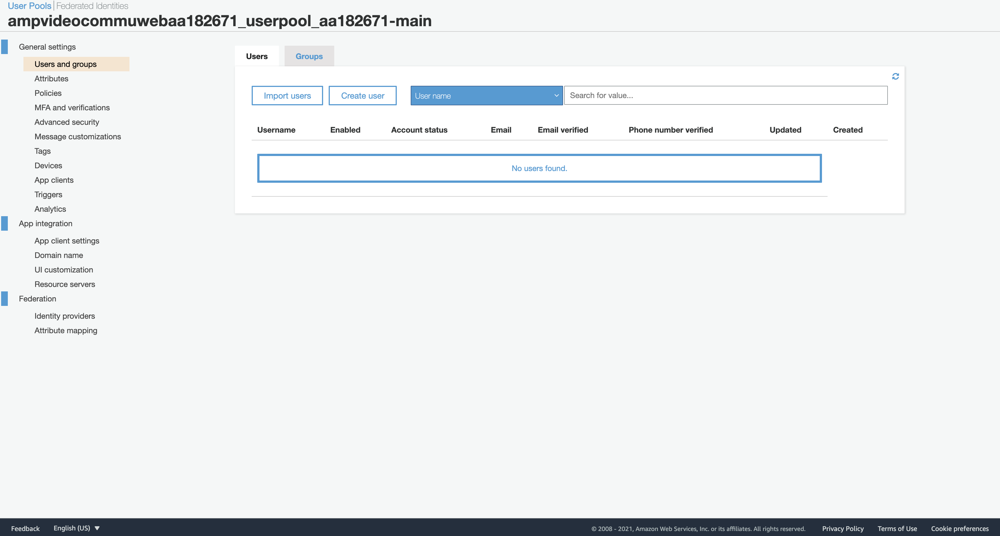
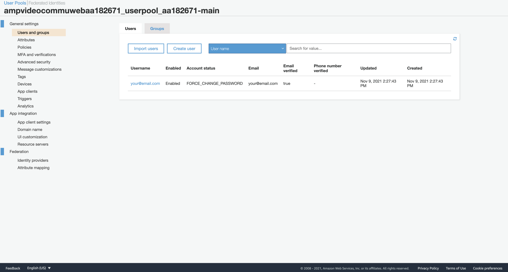
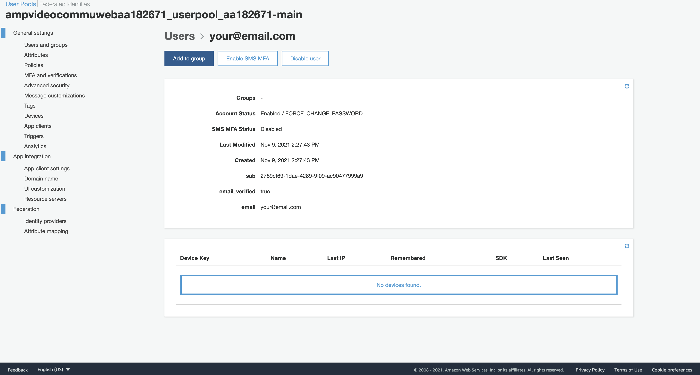
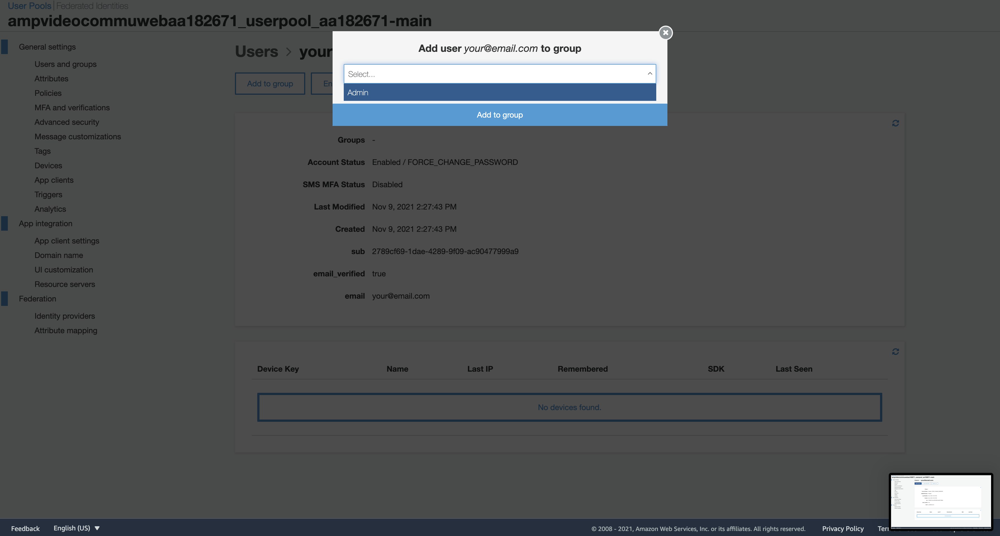
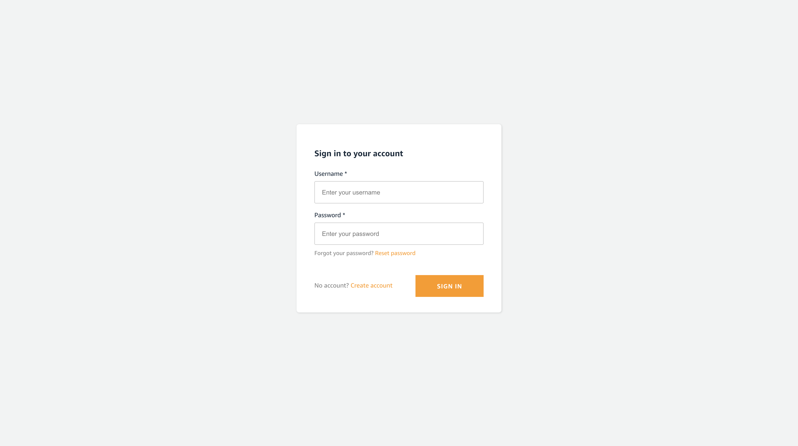
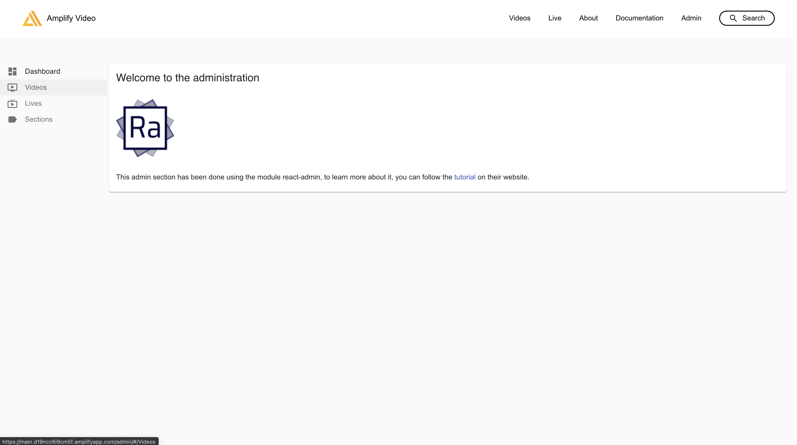

# Deployment

## Requirements
* [AWS Account](https://aws.amazon.com/account/)
* [GitHub Account](https://github.com)
* [Node 14 or greater](https://nodejs.org/en/download/)
* [Amplify CLI 6.3.1 or greater installed and configured](https://aws-amplify.github.io/docs/cli-toolchain/quickstart#quickstart)
* [Amplify Video Plugin 3.8.2 or greater installed and configured](https://github.com/awslabs/amplify-video)


## Instructions
Follow these instructions to deploy the community site:

### Deploy using Amplify Console

1. Fork the community [website repository](https://github.com/aws-samples/amplify-video-community)

2. Go to Amplify console then click `New app -> Host web app`
3. Select Github and click `Continue`

4. Select your repository and the target branch
    
    4.1. check "`Connecting a monorepo ? Pick a folder.`" and copy/paste:
    ```bash
    apps/community-website 
    ```
    4.2. click `Next`
    
    

5. Configure build settings

6. Review build settings

7. Provision, build and deploy your app


8. Select in the sidebar `Rewrites and redirects`, click `Edit` and remove both rules



### Pull backend locally
To continue working on the backend, install the Amplify CLI and make updates by running the command below from the root of your project folder.


```bash
cd amplify-video-community/apps/community-website
```

```bash
amplify pull --appId <your-app-id> --envName <your-env>
```

### Create administrator account

1. Go to AWS Cognito (make sur you are in the correct region). Click `Manage User Pools`


2. Select your user pool


3. Click `Users and groups` 


4. Click `Create user`



5. Select your created user


6. Add to group


7. Select Admin group and click `Add to group`


You can now visit your application using the link under `Front environments` 

`https://<your_env>.<app_id>.amplifyapp.com/admin`




