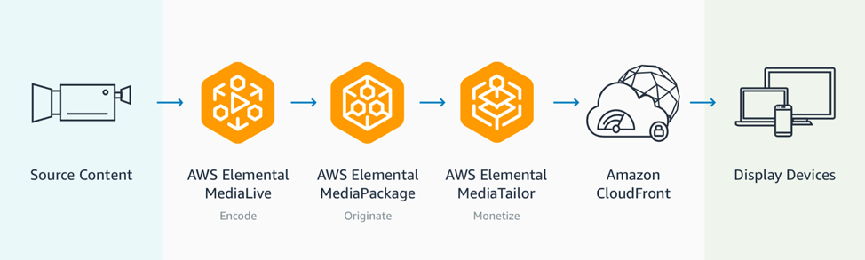

# Introducing AWS Amplify Video

Amplify Video is an open source plugin for the Amplify CLI that makes it easy to incorporate video streaming into your mobile and web applications powered by AWS Amplify. In this blog post, we introduce readers to AWS Amplify, AWS Elemental Media Services, and Amplify Video. Then, through a tutorial, we show how they work together to deploy a live stream sourced from a webcam, sent to AWS for processing, and displayed back on a browser.

It’s never been easier to produce and distribute video. Armed with a smartphone equivalent of a studio in our pockets, anyone can be a journalist, e-sports broadcaster, or home cooking star with enough time and energy. Platforms like YouTube, Facebook, and Amazon’s Twitch remove distribution hurdles for creators, but these platforms aren’t always ideal for businesses who require full creative control of their content and user-experience.

Deploying a direct-to-consumer video service starts with a mobile or web application. At AWS, we’ve released numerous services to remove the heavy-lifting from application development and operations. Services like AWS Elastic Beanstalk, AWS OpsWorks, and AWS CloudFormation have served the development community for years, but we believe that there is always room to improve the development experience. That’s why we released AWS Amplify-a platform comprised of a development framework, tools, and services–that makes it easy to create, configure, and implement scalable mobile and web apps powered by AWS. If you haven’t checked out Amplify yet, get started at https://aws.amazon.com/amplify.

Regardless of how we manage the stack, bringing video into an application demands experience to reliably scale encoding, packaging, and content delivery. For video delivery, much of this undifferentiated heavy lifting is solved by using the AWS Elemental Media Services. Through a decade of experience and innovation by AWS Elemental, these services enable broadcast-quality live and file-based video workflows while managing the underlying infrastructure (failures, patching, and scaling) on your behalf. Launched at re:Invent 2017, the Media Services are already being used to carry live sporting events (NFL and Pac-12) and enrich news experiences through Arc, a platform by The Washington Post.

Customers often ask us – why six separate services? First, this separation grants our service teams the autonomy to innovate on behalf of their customers. Second, it offers an alternative to strings-attached-tightly-coupled-black-box solutions that our customers have told us they simply do not want. Our approach encourages interoperability with industry partners and allows customers to design without fear of lock-in. However, system design is all about trade-offs and with this approach we trade simplicity for flexibility by asking builders to understand and integrate each service in order to deliver their content.

Four AWS services are used to host a live stream that uses ad insertion and a Content Delivery Network.

Enter AWS Amplify Video: an open source plugin for the Amplify Command Line Interface that makes it easy to deploy video services and integrate them into your applications. By answering a few prompts in the command line, Amplify Video spins up infrastructure that adheres to best practices codified by the AWS community. Today, Amplify CLI users can use the Amplify Video plugin to launch and manage their live streams backed by AWS Elemental Media Services. Video-on-demand support and other AWS community requested capabilities will come later in 2019. If you have suggestions, ideas, or feedback on the plugin, please let us know!

Read more about amplify-video: https://aws.amazon.com/blogs/media/introducing_aws_amplify_video/
